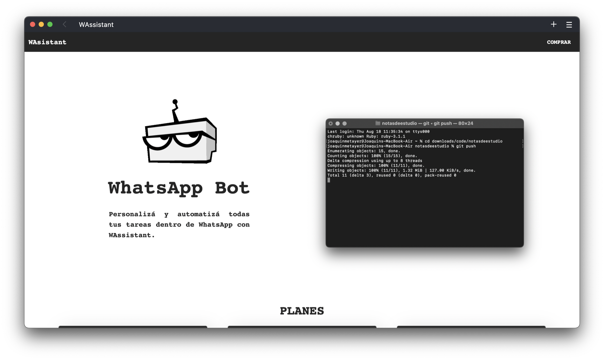
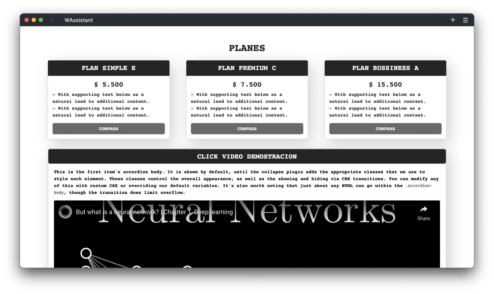

# WAssistant

HTML, CSS and BOOSTRAP

Sitio web diseñado para producto (real, no ficticio) sobre un script que automatiza procesos dentro de whatsapp.
El código que encontrarás aquí no será el mismo al del sitio oficial del producto, aunque contiene todas sus funciones.
 
Live view https://joaquinmetayer.github.io/wassistant/

